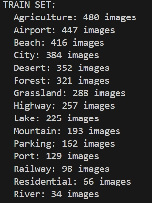
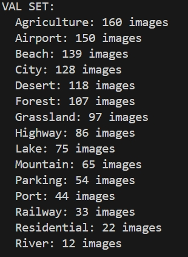
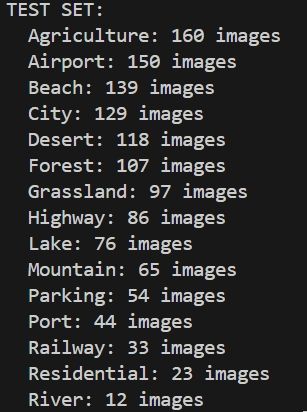
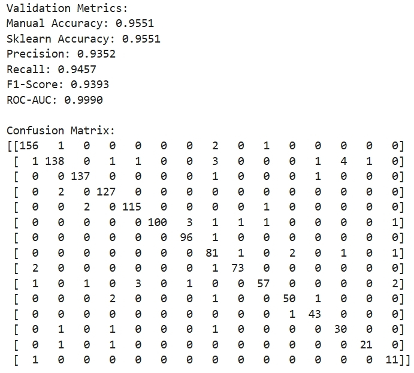

# Aerial Scene Classification

---

## Table of Contents  
- [Project Overview](#project-overview)  
- [Key Features](#key-features)  
- [Installation](#installation)  
- [Data Preparation](#data-preparation)  
- [Training & Evaluation](#training--evaluation)  
- [Interpretability Analysis](#interpretability-analysis)  
- [Example Results](#example-results)  
- [License](#license)  

---

## Project Overview  
This project implements an aerial scene classification system using **traditional machine learning** and **deep learning methods**. It includes:  
1. **Data augmentation** to enhance generalization.  
2. **Transfer learning** with pre-trained models.  
3. **Visual explanations** via Grad-CAM attention maps.  
4. **Robustness testing** under noise and occlusion.  

---

## Key Features  
### Data Augmentation  
```python
train_transforms = transforms.Compose([
    transforms.Resize(256),
    transforms.RandomRotation(20),
    transforms.RandomHorizontalFlip(),
    transforms.ColorJitter(brightness=0.2, contrast=0.2, saturation=0.2),
    transforms.RandomResizedCrop(224, scale=(0.8, 1.0)),
    transforms.ToTensor(),
    transforms.Normalize([0.485, 0.456, 0.406], [0.229, 0.224, 0.225])
])
```

---

## Installation
### Dependencies
```python
pip install torch torchvision opencv-python albumentations matplotlib numpy
```
### Clone Repository
```python
git clone https://github.com/IgleEgrous/mygo-9517?tab=readme-ov-file
```

---

## Data Preparation
### Dataset Structure
```plaintext
archive/
  ├── balanced/
    ├── train/
    │   ├── airport/
    │   ├── forest/
    │   └── ...
    ├── val/
    └── test/
  ├── imbalanced/
```
### Download Dataset
* Source: [SkyView Dataset on Kaggle](https://www.kaggle.com/datasets/ankit1743/skyview-an-aerial-landscape-dataset)

* original dataset: 15 classes, 800 images per class.
* balanced dataset: 15 classes, 480 images per train set, 160 images per validation and test set.
* imbalanced dataset: as shown below.
<center class='half'>
    
</center>
---

## Training & Evaluation
### Train a Model
#### VGG16
### Evaluate a Model

### Output Metrics
* Classification report (Precision/Recall/F1)

* Confusion matrix

* Per-class accuracy
---

## Example Results
### Classification Performance
#### VGG16
imbalanced dataset with augmentation



more details you can look at [val.ipynb](https://github.com/IgleEgrous/mygo-9517/blob/main/val.ipynb)
---

## License
This project is licensed under the [MIT License](https://opensource.org/license/mit).

## Acknowledgments
* Dataset provider: Kaggle community
* Reference papers:
     * [Grad-CAM: Visual Explanations from Deep Networks](https://arxiv.org/abs/1610.02391)
* Readme template:
     * [Best-README-Template](https://github.com/othneildrew/Best-README-Template)
## Contact
* z5513840@ad.unsw.ed.au